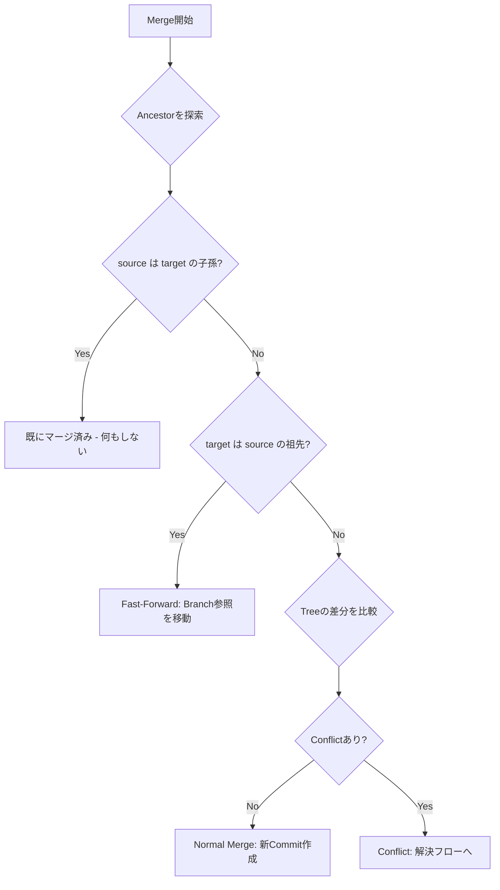

# 技術設計書: 物理Gitシミュレータ

## Overview

物理Gitシミュレータは、Gitの内部構造（Blob / Tree / Commit / Branch / HEAD）を視覚的に再現するWebアプリケーションである。教育・検証用途に特化し、Gitを「再発明させる」体験を提供する。

### 技術選定方針

ユーザー要望に基づき、軽量・シンプルな技術スタックを採用する。

- **フロントエンド**: React + TypeScript（Vite）
- **状態管理**: React組み込み（useReducer + Context）— 外部ライブラリ不要
- **DAGグラフ描画**: SVG直接描画（カスタム軽量実装）— 外部グラフライブラリ不要
- **差分表示**: シンプルな行単位diff（カスタム実装）
- **ID生成**: SHA-1ライクな短縮ハッシュ（`crypto.subtle`利用）+ 連番 + 疑似ハッシュ
- **永続化**: ブラウザのlocalStorage（MVP）
- **ビルド**: Vite
- **テスト**: Vitest + fast-check（プロパティベーステスト）

### 選定理由

| 選択 | 理由 |
|------|------|
| React + Vite | 軽量セットアップ、高速HMR、TypeScript標準サポート |
| useReducer + Context | 外部依存なし、Gitオペレーションの状態遷移と相性が良い |
| SVGカスタム描画 | D3-dagやReact Flowは本用途にはオーバースペック。DAGのノード数は教育用途で少数（〜50程度）のため、シンプルなSVG描画で十分 |
| localStorage | サーバー不要、MVP向け。将来的にexport/importで拡張可能 |
| fast-check | TypeScript対応のPBTライブラリ。Gitオブジェクトの不変性・整合性検証に最適 |

## Architecture

### 全体構成

```
┌─────────────────────────────────────────────────┐
│                   React App                      │
│                                                  │
│  ┌──────────┐  ┌──────────┐  ┌───────────────┐  │
│  │ Command  │  │  Detail  │  │  DAG Graph    │  │
│  │  Panel   │  │  Panel   │  │  View (SVG)   │  │
│  └────┬─────┘  └────┬─────┘  └───────┬───────┘  │
│       │              │                │          │
│  ┌────▼──────────────▼────────────────▼───────┐  │
│  │           SimulatorContext (useReducer)     │  │
│  └────────────────────┬───────────────────────┘  │
│                       │                          │
│  ┌────────────────────▼───────────────────────┐  │
│  │              Core Engine                    │  │
│  │  ┌─────────────┐  ┌─────────────────────┐  │  │
│  │  │ ObjectStore │  │     RefStore        │  │  │
│  │  │ (Blob,Tree, │  │ (Branch, HEAD)      │  │  │
│  │  │  Commit)    │  │                     │  │  │
│  │  └─────────────┘  └─────────────────────┘  │  │
│  │  ┌─────────────┐  ┌─────────────────────┐  │  │
│  │  │  ID Gen     │  │  Merge Engine       │  │  │
│  │  │ (3 modes)   │  │ (FF/Normal/Conflict)│  │  │
│  │  └─────────────┘  └─────────────────────┘  │  │
│  └────────────────────────────────────────────┘  │
│                       │                          │
│  ┌────────────────────▼───────────────────────┐  │
│  │         Persistence (localStorage)         │  │
│  └────────────────────────────────────────────┘  │
└─────────────────────────────────────────────────┘
```

### レイヤー構成

1. **Core Engine層**（純粋ロジック、UIに依存しない）
   - ObjectStore: Blob・Tree・Commitの不変オブジェクト管理
   - RefStore: Branch・HEADの可変参照管理
   - IDGenerator: 3モードのID生成
   - MergeEngine: Fast-Forward判定・Conflict検出・Ancestor探索
   - Validator: オブジェクト参照の整合性検証

2. **State Management層**（React Context + useReducer）
   - SimulatorState: Core Engineの状態をラップ
   - SimulatorDispatch: ユーザー操作をCore Engineのアクションに変換

3. **UI層**（React コンポーネント）
   - CommandPanel: 操作パネル（Blob作成、Commit、Merge等）
   - DetailPanel: 選択オブジェクトの詳細表示
   - DAGGraphView: Commit履歴のDAGグラフ（SVG）
   - ConflictResolver: Conflict解決UI
   - Legend: オブジェクト種別の凡例


## Components and Interfaces

### Core Engine

#### ObjectStore

```typescript
// オブジェクトの型定義
type ObjectId = string;

interface Blob {
  readonly type: "blob";
  readonly id: ObjectId;
  readonly content: string;
}

interface TreeEntry {
  readonly name: string;
  readonly objectId: ObjectId; // BlobまたはTreeのID
}

interface Tree {
  readonly type: "tree";
  readonly id: ObjectId;
  readonly entries: readonly TreeEntry[];
}

interface Commit {
  readonly type: "commit";
  readonly id: ObjectId;
  readonly treeId: ObjectId;
  readonly parentIds: readonly ObjectId[]; // 0=初期, 1=通常, 2+=Merge
  readonly message: string;
}

type GitObject = Blob | Tree | Commit;

// ObjectStore インターフェース
interface ObjectStore {
  get(id: ObjectId): GitObject | undefined;
  has(id: ObjectId): boolean;
  addBlob(content: string): Blob;        // 同一内容チェック付き
  addTree(entries: TreeEntry[]): Tree;    // 参照先存在チェック付き
  addCommit(treeId: ObjectId, parentIds: ObjectId[], message: string): Commit;
  getAllByType(type: "blob" | "tree" | "commit"): GitObject[];
  findBlobByContent(content: string): Blob | undefined;
}
```

#### RefStore

```typescript
interface RefStore {
  // Branch操作
  createBranch(name: string, commitId: ObjectId): void;
  moveBranch(name: string, commitId: ObjectId): void;
  deleteBranch(name: string): void;
  getBranch(name: string): ObjectId | undefined;
  getAllBranches(): Map<string, ObjectId>;

  // HEAD操作
  getHead(): HeadRef;
  checkoutBranch(name: string): void;
  checkoutCommit(commitId: ObjectId): void; // Detached HEAD
  advanceHead(newCommitId: ObjectId): void;
}

type HeadRef =
  | { type: "branch"; name: string }
  | { type: "detached"; commitId: ObjectId };
```

#### IDGenerator

```typescript
type IdMode = "sequential" | "pseudo-hash" | "content-hash";

interface IDGenerator {
  generate(content: string, mode: IdMode): ObjectId;
  setMode(mode: IdMode): void;
  getMode(): IdMode;
  // 既存IDを新モードで再マッピング
  remapId(oldId: ObjectId, content: string): ObjectId;
}
```

#### MergeEngine

```typescript
interface MergeResult {
  type: "fast-forward" | "normal" | "conflict";
}

interface FastForwardResult extends MergeResult {
  type: "fast-forward";
  targetCommitId: ObjectId;
}

interface NormalMergeResult extends MergeResult {
  type: "normal";
  mergeCommit: Commit;
}

interface ConflictResult extends MergeResult {
  type: "conflict";
  conflicts: ConflictEntry[];
}

interface ConflictEntry {
  path: string;
  ancestor: string | null;  // Ancestorの内容
  ours: string;             // HEAD側の内容
  theirs: string;           // 相手Branch側の内容
}

type ResolveChoice = "ours" | "theirs" | { manual: string };

interface MergeEngine {
  merge(sourceBranch: string, targetBranch: string): MergeResult;
  findAncestor(commitA: ObjectId, commitB: ObjectId): ObjectId | null;
  resolveConflict(entry: ConflictEntry, choice: ResolveChoice): string;
  isFastForward(source: ObjectId, target: ObjectId): boolean;
}
```

### State Management

```typescript
// Simulator全体の状態
interface SimulatorState {
  objectStore: ObjectStore;
  refStore: RefStore;
  idMode: IdMode;
  selectedObjectId: ObjectId | null;
  mergeState: MergeState | null; // Merge進行中の状態
  stepHistory: StepRecord[];     // 操作ステップの履歴（要件6対応）
}

type MergeState = {
  sourceBranch: string;
  targetBranch: string;
  conflicts: ConflictEntry[];
  resolved: Map<string, string>; // path -> resolved content
};

// 操作ステップ記録（要件6: ステップごと表示用）
interface StepRecord {
  action: string;
  description: string;
  objectsCreated: ObjectId[];
  refsUpdated: string[];
}

// Reducer Actions
type SimulatorAction =
  | { type: "CREATE_BLOB"; content: string }
  | { type: "CREATE_TREE"; entries: TreeEntry[] }
  | { type: "CREATE_COMMIT"; treeId: ObjectId; parentIds: ObjectId[]; message: string }
  | { type: "HIGH_LEVEL_COMMIT"; files: { name: string; content: string }[]; message: string }
  | { type: "CREATE_BRANCH"; name: string; commitId: ObjectId }
  | { type: "MOVE_BRANCH"; name: string; commitId: ObjectId }
  | { type: "CHECKOUT_BRANCH"; name: string }
  | { type: "CHECKOUT_COMMIT"; commitId: ObjectId }
  | { type: "START_MERGE"; sourceBranch: string }
  | { type: "RESOLVE_CONFLICT"; path: string; choice: ResolveChoice }
  | { type: "COMPLETE_MERGE"; message: string }
  | { type: "FIX_COMMIT"; files: { name: string; content: string }[]; message: string }
  | { type: "SET_ID_MODE"; mode: IdMode }
  | { type: "SELECT_OBJECT"; objectId: ObjectId | null };
```

### UI Components

```
App
├── Header（タイトル、IDモード切替）
├── MainLayout
│   ├── CommandPanel（左サイドバー）
│   │   ├── BlobCreator
│   │   ├── TreeCreator
│   │   ├── CommitCreator（低レベル）
│   │   ├── HighLevelCommit（高レベル）
│   │   ├── BranchManager
│   │   ├── CheckoutPanel
│   │   ├── MergePanel
│   │   └── FixPanel
│   ├── DAGGraphView（中央、SVG）
│   │   ├── CommitNode
│   │   ├── BranchLabel
│   │   ├── HeadIndicator
│   │   └── EdgeLine
│   └── DetailPanel（右サイドバー）
│       ├── ObjectDetail（Blob/Tree/Commit詳細）
│       ├── RefList（Branch・HEAD一覧）
│       └── StepHistory（操作ステップ表示）
├── ConflictResolver（モーダル/オーバーレイ）
│   ├── ThreeWayView（Ancestor/Ours/Theirs表示）
│   ├── DiffHighlight（差異強調）
│   └── ResolveActions（解決方法選択）
└── Legend（凡例、初回表示）
```


## Data Models

### オブジェクトストア内部構造

```typescript
// ObjectStoreの内部実装
class ObjectStoreImpl implements ObjectStore {
  private objects: Map<ObjectId, GitObject> = new Map();
  private idGenerator: IDGenerator;

  // 内容からIDを生成し、不変オブジェクトとして格納
  // Object.freeze()で不変性を保証
}
```

### 永続化データ構造（localStorage）

```typescript
interface PersistedState {
  version: 1;
  objects: Array<{
    id: ObjectId;
    type: "blob" | "tree" | "commit";
    data: Blob | Tree | Commit;
  }>;
  branches: Array<{ name: string; commitId: ObjectId }>;
  head: HeadRef;
  idMode: IdMode;
}
```

### DAGレイアウト計算

```typescript
// DAGグラフのレイアウト計算用データ構造
interface DAGNode {
  commitId: ObjectId;
  x: number;           // 水平位置（Branch列）
  y: number;           // 垂直位置（時系列）
  parentIds: ObjectId[];
  branchNames: string[];
  isHead: boolean;
}

interface DAGLayout {
  nodes: DAGNode[];
  edges: Array<{ from: ObjectId; to: ObjectId }>;
  width: number;
  height: number;
}
```

DAGレイアウトはトポロジカルソートに基づく簡易アルゴリズムで計算する。教育用途でノード数が少ないため、複雑なレイアウトアルゴリズムは不要。

### ID生成の3モード

| モード | 生成方法 | 表示例 | 用途 |
|--------|----------|--------|------|
| sequential | 種別プレフィックス + 連番 | `blob-1`, `tree-2`, `commit-3` | 初学者向け、直感的 |
| pseudo-hash | ランダム8文字hex | `a3f2b1c9` | ハッシュの概念導入 |
| content-hash | SHA-1の先頭8文字 | `2cf24dba` | 内容依存IDの理解 |

### Merge判定フロー



### オブジェクト種別の視覚表現

| 種別 | 色 | 形状 | 区分 |
|------|-----|------|------|
| Blob | 青 (#3B82F6) | 角丸四角 | 不変オブジェクト |
| Tree | 緑 (#10B981) | フォルダ型 | 不変オブジェクト |
| Commit | 黄 (#F59E0B) | 円 | 不変オブジェクト |
| Branch | 紫 (#8B5CF6) | ラベル型 | 可変参照 |
| HEAD | 赤 (#EF4444) | 矢印付きラベル | 可変参照 |

