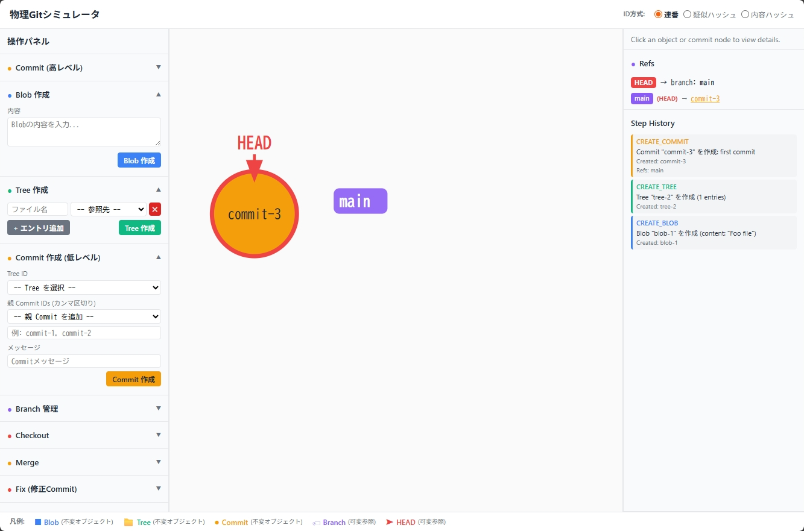

# Physical Git Simulator

Gitの内部構造（Blob / Tree / Commit / Branch / HEAD / Merge / Conflict）を視覚的に再現する教育・検証用Webアプリケーション。

一般的なGitクライアントやCLI学習ツールではなく、Gitを「再発明させる」体験を提供することを目的としている。物理Gitゲームのルール事前検証にも利用可能。

## スクリーンショット



## 特徴

- **Gitオブジェクトの可視化** — Blob・Tree・Commitの作成過程をステップごとに表示
- **コンテンツアドレッシング体験** — Blobの内容を「形状×数字」の2ワードで表現し、4×4のContent_Matrixで重複登録を視覚的にブロック
- **DAGグラフ描画** — Commit履歴を有向非巡回グラフとしてSVGで描画。分岐・合流を視覚的に表現
- **Branch・HEAD操作** — Branch作成・移動・Checkout・Detached HEADを体験
- **Merge・Conflict解決** — Fast-Forward / 通常Merge / Conflictの3パターンを再現。Ancestor・Ours・Theirsの3-way比較
- **不変性の体験** — Object.freezeによるオブジェクトの不変性を実際に確認可能
- **ID方式切替** — 連番 / 疑似ハッシュの2モードを切り替えて学習段階に対応。BlobのコンテンツアドレッシングはContent_Matrixで視覚的に体験
- **ブラウザ完結** — サーバー不要。localStorageで状態を永続化

## オブジェクト種別と視覚表現

| 種別 | 色 | 区分 |
|------|-----|------|
| Blob | 青 (#3B82F6) | 不変オブジェクト |
| Tree | 緑 (#10B981) | 不変オブジェクト |
| Commit | 黄 (#F59E0B) | 不変オブジェクト |
| Branch | 紫 (#8B5CF6) | 可変参照 |
| HEAD | 赤 (#EF4444) | 可変参照 |

## 技術スタック

- React 19 + TypeScript（Vite）
- 状態管理: useReducer + Context
- DAGグラフ: SVGカスタム描画（外部ライブラリ不使用）
- 差分表示: 行単位diffカスタム実装
- テスト: Vitest + fast-check（プロパティベーステスト）
- 永続化: localStorage

## セットアップ

```bash
npm install
npm run dev
```

## スクリプト

| コマンド | 説明 |
|----------|------|
| `npm run dev` | 開発サーバー起動 |
| `npm run build` | プロダクションビルド |
| `npm run preview` | ビルド結果のプレビュー |
| `npm run test` | テスト実行 |
| `npm run test:watch` | テストのウォッチモード |
| `npm run lint` | ESLint実行 |

## アーキテクチャ

```
Core Engine（純粋ロジック）
├── ObjectStore — Blob・Tree・Commitの不変オブジェクト管理
├── RefStore — Branch・HEADの可変参照管理
├── IDGenerator — 2モードのID生成（連番 / 疑似ハッシュ）
└── MergeEngine — FF判定・Conflict検出・Ancestor探索

State Management（React Context + useReducer）
└── SimulatorReducer — ユーザー操作をCore Engineのアクションに変換

UI（React コンポーネント）
├── CommandPanel — 操作パネル（左）
├── DAGGraphView — Commit履歴のDAGグラフ（中央）
├── DetailPanel — オブジェクト詳細・Ref一覧・Step History（右）
└── ConflictResolver — Conflict解決UI
```

## ライセンス

MIT
